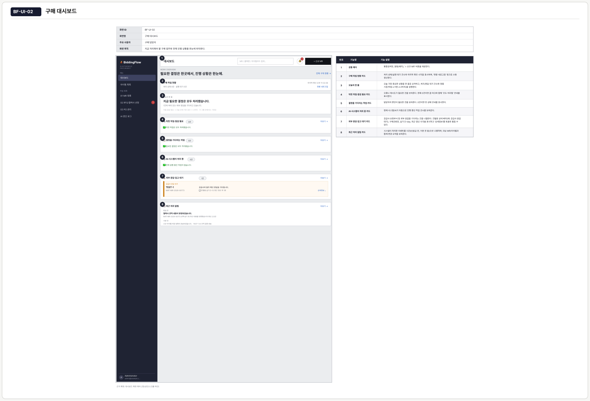
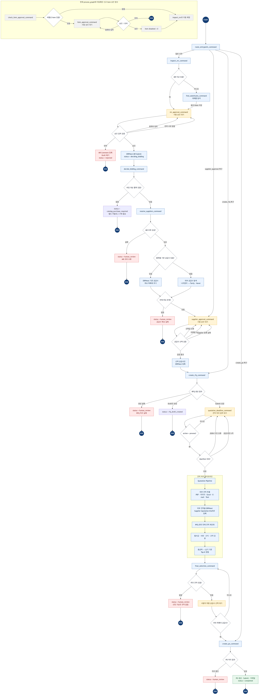
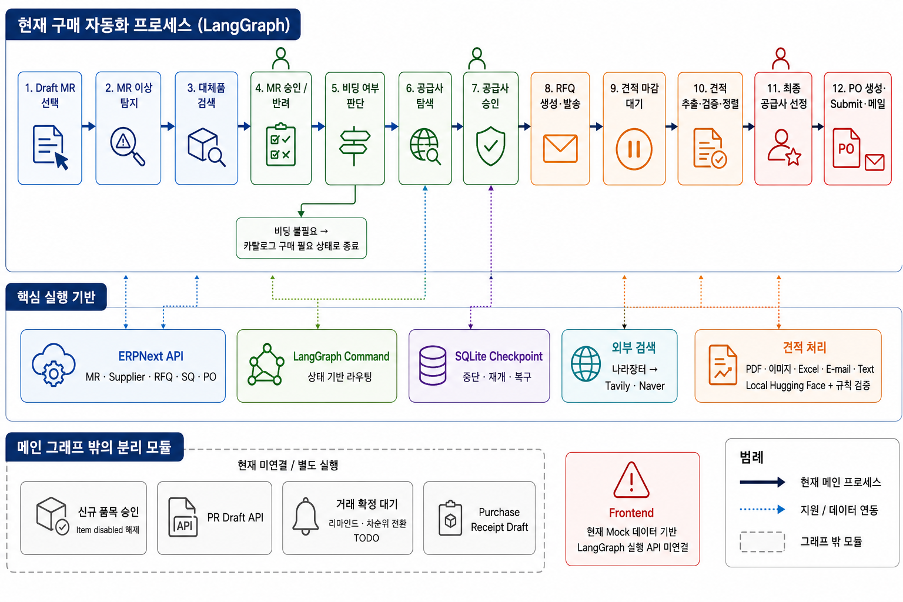
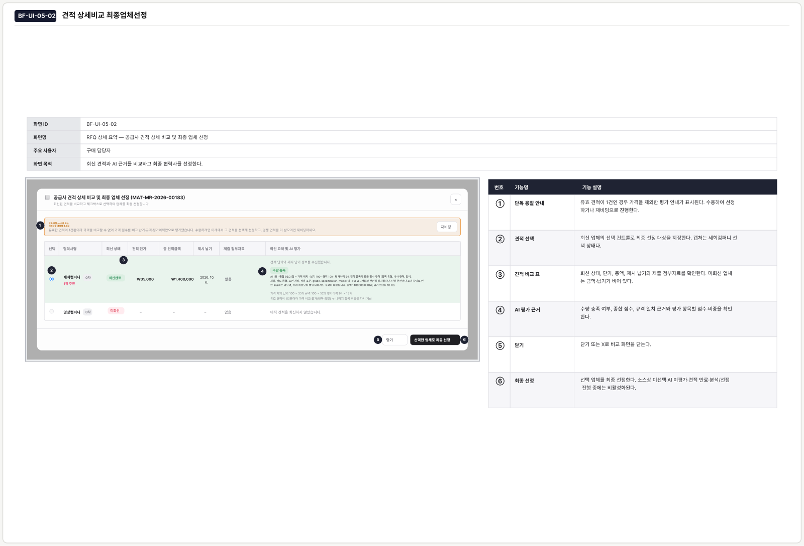
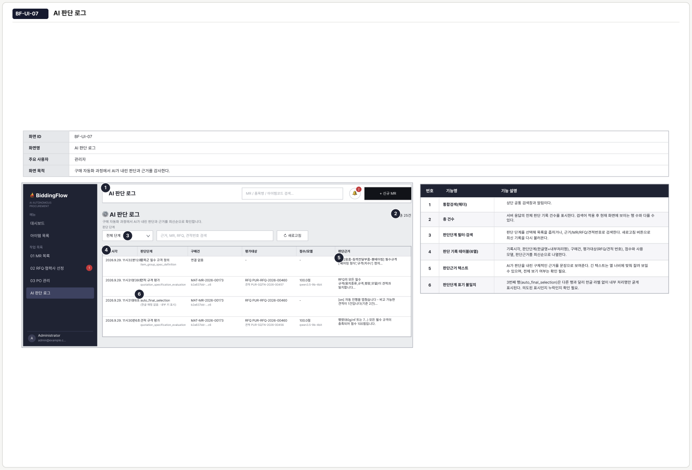
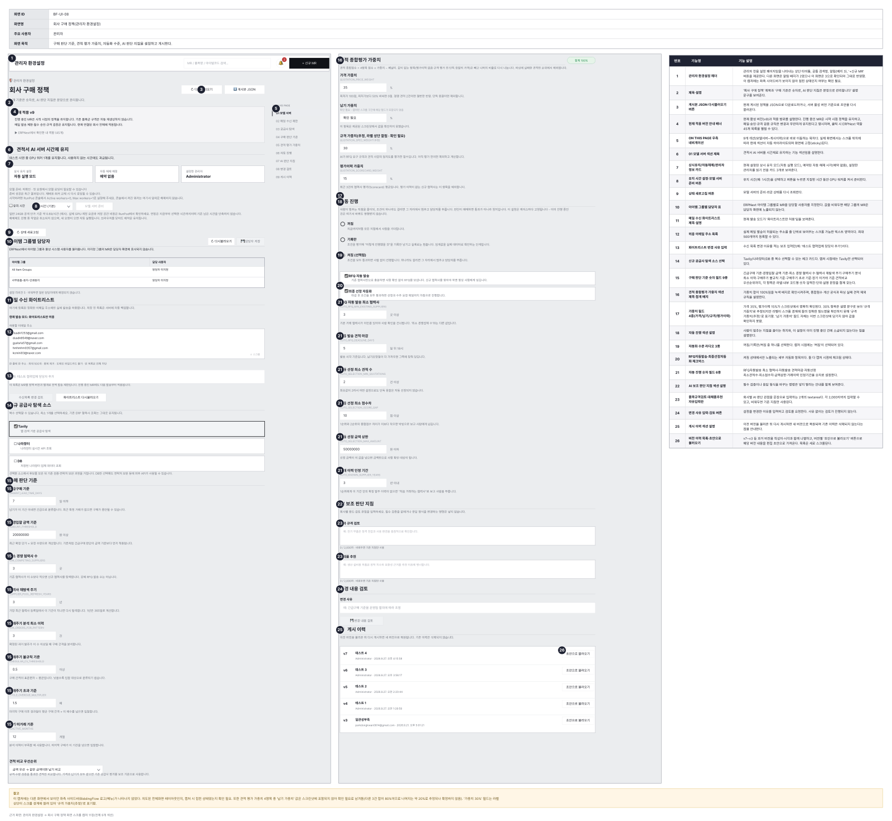
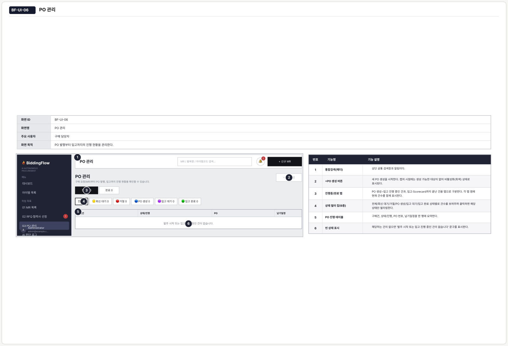

<div align="center">

# ⛵ BiddingFlow

### 구매는 물 흐르듯, 결정은 신중하게.

구매 부서의 반복 업무를 자동화하는 AI 에이전트

<br>

**AI가 읽고, 회사 정책이 정합니다.**

문서를 읽고 규격을 판정하는 일은 모델이 맡지만,<br>
순위를 계산하고 자동으로 진행할지 사람을 부를지는 회사가 정한 기준이 결정합니다.

<br>


<br>

[**🌐 서비스**](https://biddingflow.13.209.103.102.nip.io/) ·
[**🗂 ERPNext**](http://13.209.103.102:8080) ·
[**🖥 화면정의서**](https://htmlpreview.github.io/?https://github.com/SKNETWORKS-FAMILY-AICAMP/SKN31-FINAL-3Team/blob/main/docs/%ED%99%94%EB%A9%B4%EC%A0%95%EC%9D%98%EC%84%9C.html) ·
[**📋 자동화 명세**](docs/automation-spec.md) ·
[**🧪 테스트 결과**](docs/TEST_PLAN_AND_RESULTS.md) ·
[**🎤 발표 대본**](presentation/발표대본_v2.md)

</div>

<br>

<div align="center">
  
  <p><sub><b>구매 대시보드</b> — 막힌 작업 / 내가 결정할 작업 / 처리 중 / 외부 응답 대기로 할 일을 갈라 보여줍니다.</sub></p>
</div>

<br>

---

## 📌 한눈에 보기

ERP에 구매 요청을 등록한 뒤에도 구매 부서의 일은 계속됩니다. 규격을 확인하고, 거래 업체를 찾고, 견적을 요청하고, 답이 없으면 재촉합니다. 견적서가 오면 단가와 납기를 옮겨 적으며 규격을 비교합니다. 문제가 생기면 처음부터 다시 반복합니다.

**BiddingFlow는 이렇게 문서와 문서 사이에 남아 있는 반복 업무를 자동화합니다.** 원본 구매 문서는 ERPNext가 그대로 관리하고, BiddingFlow는 그 사이의 실행을 맡습니다. 반복 가능하고 정책으로 정의할 수 있는 업무는 자동으로 처리하되, 예외 상황이나 승인이 필요한 단계에서는 담당자에게 **판단 근거와 함께** 작업을 넘깁니다.

### 처리 시간 — 동일 품목·수량·공급업체 조건에서 단계별 실측

| 단계 | 기존 구매 프로세스 | BiddingFlow | 비교 기준 |
|---|---|---|---|
| **대체품 탐색** | 재고·유사품 직접 조회 · 약 30분 | AI 자동 추천 · **실측 4.9초** | 처리시간 |
| **구매방식 결정** | 담당자 경험·판단에 따라 상이 | 규칙 기반 **자동 판정** | 정성 평가 |
| **신규 협력업체 탐색** | 검색 → 홈페이지 → 연락처 수집 · 약 2~3일 | Tavily/Naver + LLM + DART<br>(후보 7개 확보) · **실측 41.5초** | 처리시간 |
| **미회신 독촉** | 대상 확인 + 메일 작성·발송 · 약 10분 | 자동 스케줄 발송 · **즉시** | 인적 시간 |
| **견적 분석·선정** | 견적 확인·입력·비교 · 약 2~3시간 | 포털 견적 수신 → 규격 평가 완료 · **실측 136.2초** | 수신 후 경과시간 |
| **PO 처리** | 수주 확인 → PO 작성 → 승인 → 발송 · 약 10분 | 수락 → 최종 승인 → PO 생성·발송 · **실측 0.8초** | 처리시간 |

> 1회 실측값이며, 기존 프로세스 수치는 측정이 아닌 업무 기준 추정치입니다. 견적은 파일 추출 미실행·처리 대기를 포함하고, PO는 승인 대기를 포함합니다. 공급사의 견적·수주 회신 대기 시간은 제외했습니다.

### 그 밖의 성과

| 영역 | 지표 | 결과 |
|---|---|---|
| **견적서 추출 모델**<br><sub>Qwen3.5-9B · 4-bit QLoRA · 2 epoch</sub> | 전체 정답값 정확도 | **64.4% → 98.5%** (+34.1%p, 632 → 966 / 981개 값) |
| | 규격 필드 | **29.9% → 100%** (+70.1%p) |
| | 공급사명 / 품목명 | **29.6% → 97.5%** / **38.5% → 100%** |
| | 평균 생성 시간 | **4.07초 → 2.98초** |
| **공급사 탐색** | 홈페이지 확보 | **7곳 → 16곳** / 20곳 (폴백 구조 도입) |
| | 유료 검색 호출 | 전수 탐색 대비 **20회 → 13회** (−35%) |
| | 연락처 추출 LLM 호출 | **16회 → 4회** (배치 처리, −75%) |
| | 입력 토큰 / 처리 시간 | **−24% / −59%** |
| **검증** | 자동화 테스트 | **771건 통과** (테스트 파일 85개) |

> 모델 지표는 내부 검증 100장(원본 12종) 기준입니다. 증강본이 원본 단위로 분리되지 않은 한계가 있어 실제 신규 양식·필체에 대한 일반화 성능은 별도 검증이 필요합니다. [한계와 향후 과제](#13-한계와-향후-과제)를 참고해 주세요.

<br>

---

## 1. 팀 및 팀원 소개

<div align="center">
  <h3><b>Team | BiddingFlow</b></h3>
  <p>AI 기반 기업 구매·입찰 업무 자동화 플랫폼</p>
</div>

<table align="center" style="width:100%; table-layout:fixed; text-align:center;">
  <tr>
    <th>박동관</th>
    <th>김동민</th>
    <th>김세희</th>
    <th>김효민</th>
    <th>이영창</th>
  </tr>
  <tr>
    <td align="center"><a href="https://github.com/parkdongkwan0814"></a></td>
    <td align="center"><a href="https://github.com/Uranium10"></a></td>
    <td align="center"><a href="https://github.com/kimsehuikim"></td>
    <td align="center"><a href="https://github.com/hyomin0357"></a></td>
    <td align="center"><a href="https://github.com/yoong1231"></a></td>
  </tr>
  <tr>
    <td></td>
    <td></td>
    <td></td>
    <td></td>
    <td></td>
  </tr>
  <tr>
    <td align="center"><b>PM · 워크플로 설계</b><br><sub>LangGraph 구매 워크플로 설계</sub><br><sub>구매 도메인 분석, 공급사 탐색</sub><br><sub>자동화 정책, 인프라 배포</sub></td>
    <td align="center"><b>풀스택 · 인프라</b><br><sub>프론트엔드·AI 모델·백엔드 개발</sub><br><sub>데이터베이스 및 시스템 설계</sub><br><sub>인프라 배포 및 운영</sub></td>
    <td align="center"><b>프로젝트 관리 · 풀스택</b><br><sub>프로젝트 기획 및 관리</sub><br><sub>프론트엔드·백엔드·AI 모델 개발</sub><br><sub>데이터베이스 및 시스템 설계</sub></td>
    <td align="center"><b>백엔드 · 품질관리</b><br><sub>백엔드 및 AI 모델 개발</sub><br><sub>테스트 및 품질 개선</sub><br><sub>문서화·산출물 관리, 시스템 설계</sub></td>
    <td align="center"><b>AI 모델 · 품질관리</b><br><sub>AI 모델 및 백엔드 개발</sub><br><sub>테스트 및 품질 개선</sub><br><sub>데이터베이스·시스템 설계, 인프라 운영</sub></td>
  </tr>
</table>

<br>

---

## 2. 프로젝트 개요

### 2.1 배경 및 선정 이유

기업의 구매 업무는 요청 확인, 재고 조회, 공급사 검색, 견적 요청, 문서 검토, 가격·납기·규격 비교, 발주 승인처럼 여러 시스템과 담당자를 오가는 반복 작업이 많습니다.

- 이메일과 문서 중심 업무로 인한 처리 지연 및 누락
- 비정형 견적서의 수작업 입력과 비교에 드는 시간
- 담당자별로 달라질 수 있는 공급사 평가 및 선정 기준
- 구매 단계별 진행 상황과 의사결정 근거 추적의 어려움
- ERP 데이터와 실제 구매 업무 사이의 단절

### 2.2 도입 대상

ERP를 쓰면서도 구매 수작업이 많은 팀을 대상으로 보았습니다.

| | 대상 | 이유 |
|:---:|---|---|
| **01** | 반복 구매가 많은 기업 | 재고·공급사·견적을 함께 확인해야 하는 구매팀 |
| **02** | 높은 ERP 활용, 낮은 AI 도입률 | 업무 데이터는 디지털화됐지만, 행동을 판단하고 이어주는 자동화는 부족 |
| **03** | 기존 ERP와 대형 솔루션 사이의 공백 | ERP를 교체하지 않으면서 자동화할 선택지가 필요 |

중소벤처기업부 실태조사 기준 국내 스마트공장 도입 기업은 약 3만 2천 개사이며, 그중 ERP에 데이터는 있지만 견적 수집과 비교는 담당자가 직접 하는 기업을 초기 고객 후보로 삼았습니다.

**ERP로는 ERPNext를 선택했습니다.** 오픈소스라 구매 문서의 구조를 확인할 수 있고, REST API로 품목·구매 요청·견적·발주 문서를 읽고 쓸 수 있어 실제 ERP 환경에서 자동화가 어디까지 가능한지 확인하기에 적합했습니다. 다른 ERP는 커넥터 확장 대상입니다.

### 2.3 설계 원칙 — AI가 읽고, 회사 정책이 정한다

이 프로젝트의 핵심 설계 결정입니다.

**모델이 맡는 일은 "읽기"입니다.** 비정형 견적서에서 단가·납기·규격을 추출하고, 요청 규격과 특약을 문맥으로 검토해 근거와 함께 판정합니다.

**정하는 일은 회사 정책이 맡습니다.** 최종 순위를 LLM이 정하지 않습니다. 가격·납기·규격·거래 이력 점수에 회사가 설정한 가중치를 적용하고 페널티를 반영해 **계산**합니다. 같은 입력과 같은 정책이면 같은 순위가 재현되고, 담당자에게 계산 근거를 그대로 보여줄 수 있습니다.

구매에는 금전과 계약 책임이 따릅니다. "왜 이 업체가 1위인가"에 대해 모델의 출력이 아니라 **재현 가능한 계산식**으로 답할 수 있어야 한다고 봤습니다.

```
가격 · 납기  ──▶  규칙 기반 계산 (회사 정책의 기준·가중치 적용)  ──┐
                                                                  ├──▶  회사 정책 충족?  ──▶  자동 진행
규격 · 특약  ──▶  LLM이 문맥 검토 (규격 대조, 할인·보증 조건 확인) ──┘         │
                                                                         조건 미충족 ──▶  담당자 검토
```

<br>

---

## 3. 구매 프로세스 12단계

<div align="center">
  
</div>

각 단계는 LangGraph 노드로 구현되어 있습니다. ⚠️ 표시 단계는 **정책 통과 시 자동 진행, 그 외에는 담당자가 확인**하는 지점입니다.

| # | 단계 | 하는 일 |
|:---:|---|---|
| 1 | **요청·대체품 확인** ⚠️ | 품목 그룹에 공통으로 요구되는 규격과 비교해 빠진 항목을 알려주고, 재고에서 쓸 수 있는 동등·유사 품목을 근거와 함께 제시합니다 |
| 2 | **구매 방식 판단** | 과거 발주 이력과 회사 정책으로 단일 협력사 구매와 경쟁 견적 중 경로를 나눕니다 |
| 3 | **공급사 확인·탐색** | 기존 공급사를 먼저 확인하고, 부족하면 공공 조달 데이터와 웹 검색으로 회사·홈페이지·연락처를 보완합니다 |
| 4 | **견적 요청 대상 결정** ⚠️ | 추천 협력사와 견적 마감일을 한 화면에서 확인하고 RFQ 발송 대상을 확정합니다 |
| 5 | **견적 요청·회신 대기** | ERPNext RFQ를 생성·발송하고, 회신 상태를 날마다 확인해 미회신 업체에 독촉을 자동 발송합니다 |
| 6 | **견적 비교·평가** | 이메일·포털 견적을 추출하고 가격·납기·규격·거래 이력으로 평가합니다 |
| 7 | **공급사 최종 선정** ⚠️ | 자동 진행 조건을 모두 통과하면 자동 선정, 하나라도 걸리면 이유를 남기고 담당자에게 넘깁니다 |
| 8 | **PR 발송** | 선정된 공급사에 최종 조건으로 주문 가능 여부를 묻습니다 |
| 9 | **공급사 수락 대기** | 공급사가 이메일에서 수주 접수·거절을 선택합니다. 거절하면 차순위 선정 또는 재비딩으로 분기합니다 |
| 10 | **권한자 발주 승인** ⚠️ | ERP의 구매부서 팀장급 권한을 확인하고, 승인 전까지 대기 상태를 유지합니다 |
| 11 | **PO 생성·발송** | 앞 단계에서 확인된 품목·수량·가격·공급사를 **재사용해** ERP에 발주서를 만들고 발송합니다 |
| 12 | **협력사 관리·평가** | 납기 점수를 자동 계산하고 담당자 평가를 더해, 다음 구매의 거래 이력 점수로 반영합니다 |

**분기 경로** — 기존 거래·단가를 활용할 수 있으면 ②에서 ⑧로 직접구매, 견적이 부족하거나 조건이 안 맞으면 ⑥에서 ④로 재비딩, 공급사가 거절하면 ⑧·⑨에서 ⑥으로 돌아가 차순위 선정 또는 재비딩합니다.

<details>
<summary><b>단계별 구현 상세 보기</b></summary>

<br>

#### ① 대체품 판단

요청 품목과 재고 품목을 세 가지로 대조합니다.

| 필터 | 예시 |
|---|---|
| 같은 분류의 아이템인가 | 무선 마우스 요청 ↔ 유선 마우스 재고 · 둘 다 `사무용품 – 전산기기 – 마우스` |
| 요청 수량보다 많은가 | 요청 100개 ↔ 재고 770개 |
| 규격이 요청을 충족하는가 | 연결방식 · 색상 · 무게를 LLM이 대조하고 **회사 규정**과 함께 판단 |

재고를 쓰기로 하면 신규 구매 없이 종료합니다. 매번 걸러내지 않으면 있는 물건도 또 사게 됩니다.

#### ② 구매 경로 판단 기준 (관리자 설정)

담당자 경험에 따라 달라지던 판단을 정책 값으로 고정했습니다.

| 정책 키 | 기본값 | 의미 |
|---|---|---|
| `URGENT_LEAD_TIME_DAYS` | 7일 이하 | 납기가 이 기간 이내면 긴급으로 분류 |
| `AMOUNT_THRESHOLD` | 2천만 원 이상 | 최근 확정 단가 × 요청 수량으로 계산한 금액 기준 |
| `MIN_COMPETING_SUPPLIERS` | 3곳 미만 | 기존 협력사가 이 수보다 적으면 신규 협력사 탐색 |

→ 통과하면 **단일 협력사 구매**(기존 거래처 기준), 아니면 **경쟁 견적 진행**(공급사 탐색·견적 비교로 이동)

#### ③ 공급사 자동 탐색 4단계

| | 단계 | 사용 도구 |
|:---:|---|---|
| **01** | 회사명 후보 찾기 | 나라장터 데이터·API와 Tavily Search |
| **02** | 기업 정보 확인 | DART에 등록된 홈페이지와 연락처 확인 |
| **03** | 빠진 정보 보완 | 무료 Naver 우선 검색, 못 찾으면 Tavily로 재검색 |
| **04** | 담당자가 대상 선택 | 후보와 마감일을 확인한 뒤 RFQ 발송 |

#### ⑤ 미회신 독촉 로직

```
회신 상태 확인 ──▶ 회신이 왔나요?
                      ├─ 예   ──▶ 독촉 종료
                      └─ 아니오 ──▶ 발송 조건 확인
                                    (최초 발송 다음 날 이후 · 당일 독촉 이력 없음)
                                        ├─ 모두 충족 ──▶ 독촉 메일 발송
                                        └─ 미충족   ──▶ 건너뜀 ──▶ 다음 주기 재검사
```

이미 회신한 업체와 오늘 독촉한 업체에는 다시 보내지 않습니다.

#### ⑥ 견적서 유형별 처리 경로

견적서는 네 가지 형태로 도착하고, 각각 다른 경로로 처리합니다.

| 유형 | 상태 | 처리 |
|---|---|---|
| E-mail & 포털 입력 | 바로 견적 추출 가능 | ERP 자체 입력 |
| 스프레드시트 (Excel, CSV) | 값 분석 필요 | Pandas |
| 전자문서 (PDF, Word) | 텍스트 추출 필요 | PDF · Docs 파서 |
| 이미지 (스캔 PDF, 손글씨) | 이미지 분석 필요 | **비전 모델 (Qwen3.5-9B + LoRA)** |

#### ⑦ 자동 진행 판정 예시

실제 화면에 찍히는 메시지입니다.

> ⚠️ **AI 분석 실패: 자동 진행을 멈췄습니다** — 1·2순위 점수차가 8.66점으로 기준(10.0점)보다 작습니다

1위 업체가 종합 98.17점(가격 100 · 납기 100 · 규격 100 · 평가이력 90), 2위가 89.51점(규격 75)인데도 **점수 차가 기준에 못 미쳐** 자동 진행을 멈추고 담당자에게 넘깁니다. 담당자는 평가 근거와 특약사항을 눈으로 확인한 뒤 결정합니다.

#### ⑩ 권한 확인

ERPNext에 등록된 사용자 역할을 BiddingFlow에 연결했습니다. 구매부서 팀장급 권한을 받은 사용자만 발주서를 승인할 수 있고, **버튼을 숨기는 데 그치지 않고 승인 요청을 받은 서버에서 현재 권한을 다시 확인**합니다. 승인 전에는 대기 상태를 유지하며, 승인되면 앞 단계에서 확인된 정보를 재사용해 발주하므로 같은 내용을 다시 입력하지 않습니다.

#### ⑫ 협력사 평가

거래가 끝나면 납기 점수는 약정일과 실제 입고일로 **자동 계산**하고, 대응력·커뮤니케이션·품질은 담당자가 직접 평가합니다. 결과는 협력사별 거래 기록으로 쌓여 다음 구매의 거래 이력 점수가 됩니다.

</details>

<br>

---

## 4. 시스템 아키텍처

<div align="center">
  
</div>

```text
구매 담당자 · 구매 부서 · 공급사
               │
               ▼
      React 구매 업무 화면
               │ REST API / SSE
               ▼
         FastAPI 업무 API
               │
               ▼
    LangGraph 구매 오케스트레이터
       │          │           │
       │          │           └── RunPod / Qwen3.5-9B + LoRA
       │          └────────────── 외부 검색(Tavily · DART · Naver · 나라장터)
       └───────────────────────── ERPNext API / Webhook
               │
     PostgreSQL · 체크포인트 저장소
```

| 계층 | 구성 및 역할 |
|---|---|
| **사용자 화면** | React 구매 화면에서 케이스, 견적 순위, 승인 작업과 진행 상태 제공 |
| **서비스 계층** | FastAPI 업무 API와 SSE가 사용자 요청, ERPNext 웹훅 및 비동기 알림 처리 |
| **워크플로 계층** | LangGraph가 구매 단계를 제어하고 사람의 입력이 필요한 지점에서 실행을 대기·재개 |
| **업무 원천 데이터** | ERPNext가 MR, Item, Supplier, RFQ, Supplier Quotation, PO 등 구매 문서 관리 |
| **운영 데이터** | PostgreSQL이 구매 케이스, 작업, 알림, 검색 캐시, 회사 정책과 AI 판단 이력 관리 |
| **AI·검색 도구** | Qwen3.5-9B + LoRA가 견적서를 분석하고 Tavily·DART·Naver가 신규 공급사 정보를 보완 |

### 4.1 멀티 에이전트 구성

| 에이전트 | 기술 스택 | 주요 역할 및 책임 |
|---|---|---|
| **구매 오케스트레이터** | LangGraph, FastAPI | MR과 사용자 응답을 상태로 관리하고 규칙 라우팅, `interrupt/resume`, 다음 구매 단계를 제어 |
| **대체품·공급사 탐색 에이전트** | ERPNext, Tavily, DART, Naver | ERP 품목·거래 정보를 조회하고 외부 검색을 통해 대체품과 연락 가능한 공급사 후보를 수집·보완 |
| **견적서 추출 에이전트** | Qwen3.5-9B, LoRA, RunPod | 이미지·PDF 등 비정형 견적서를 JSON으로 추출·정규화·검증하고 ERP Supplier Quotation Draft로 등록 |
| **견적 검토·정렬 에이전트** | Reviewer, Ranker | 규격·수량·산식·통화·유효기간을 검증하고 가격·납기·조건에 따라 유효 견적을 평가·정렬 |
| **수주·발주 실행 에이전트** | ERPNext API, Human-in-the-loop | 최종 공급사 선택과 공급사 수락을 확인한 뒤 PR·PO를 생성·제출·발송하고, 거절 시 차순위·재비딩으로 분기 |

### 4.2 LangGraph 상태 관리와 대기 처리

구매 업무는 승인이나 공급사 회신을 기다리느라 **며칠씩 멈출 수 있습니다.** LangGraph를 선택한 이유가 여기 있습니다.

```
견적 요청  ──────────── 외부 응답을 기다리는 시간 (몇 시간, 며칠) ────────────▶  회신 도착
    │                                                                              ▲
    └── 대기 시작 시 저장 ──▶  구매 건의 진행 상태 저장 (체크포인트) ── 같은 구매 건 재개 ──┘
```

사람의 응답이 필요한 지점에서 `interrupt`로 실행을 멈추고 체크포인트에 진행 위치를 남기므로, **대기 중에는 그래프 실행이나 요청 스레드를 점유하지 않습니다.** 응답이 오면 같은 건의 저장 지점에서 이어갑니다.

저장 위치는 목적에 따라 나눴습니다.

| 저장소 | 담당 |
|---|---|
| **ERPNext** | 구매 문서의 원본 (MR, RFQ, Supplier Quotation, PO) |
| **PostgreSQL** | 구매 건의 단계, 대기 작업, 분석 결과, 회사 정책, AI 판단 이력 |
| **LangGraph 체크포인트** | 워크플로 실행 위치와 문맥 |

공유 State에는 MR·품목 정보, 라우팅 상태, 공급사·RFQ 상태, 견적 상태, 수주·PO 상태, 그리고 체크포인트의 `thread_id`와 PostgreSQL의 `case_id`를 연결하는 복구 식별자가 포함됩니다.

### 4.3 모델 실행 구조

읽는 일과 정리하는 일의 역할을 나눴습니다. 이미지에서 글자를 읽을 때는 **LoRA 어댑터를 켜고**, 읽은 내용을 정해진 필드로 정리할 때는 **어댑터를 끈 같은 기반 모델**로 JSON을 만듭니다. 모델을 두 번 올리는 게 아니라 하나의 모델에서 역할만 바꾸는 구조이며, 4비트 양자화로 GPU 메모리 사용을 줄였습니다.

모델 작업도 요청을 오래 붙잡지 않습니다. 견적서 **추출**은 RunPod에 작업을 요청하고 작업 ID를 저장한 뒤 완료 콜백을 받아 원래 요청에 연결하고, 규격 **평가**는 백그라운드에서 완료를 확인한 뒤 결과를 검증하고 저장합니다. 두 경우 모두 작업 ID를 기준으로 중복 응답과 실패 상태를 관리합니다.

### 4.4 학습 데이터 구성

견적서 이미지와 정답 JSON을 짝지은 **6,000쌍**(학습 5,900 · 검증 100)으로 구성했습니다. 실제 거래 문서 6,000건이 아니라 증강을 포함한 수치입니다.

| 손글씨 합성 | 컴퓨터 작성 | 폰트 변형 | 비대상 문서 |
|:---:|:---:|:---:|:---:|
| **3,600장** | **1,200장** | **960장** | **240장** |

비대상 문서(견적서가 아닌 문서)를 부정 예제로 넣어 "견적서가 아닌 것"도 구분하도록 했습니다.

<br>

---

## 5. 기술적 의사결정과 트러블슈팅

> 개발하면서 실제로 막혔던 지점과, 그걸 어떻게 해결했는지 측정값과 함께 정리했습니다.

### 🔧 비용을 아끼려다 공급사 후보를 절반 잃은 일

**문제** — 신규 공급사를 찾을 때 어려웠던 건 회사를 찾는 일이 아니라 **연락처를 확보하는 일**이었습니다. 검색 결과 요약문이 100자 남짓이라 회사명과 연락처를 한 번에 뽑을 수 없어 이름 수집과 연락처 보강을 분리했는데, 여기서 비용 문제가 생겼습니다. 회사 이름은 Tavily 검색이 잘 찾았지만, 찾아낸 회사마다 홈페이지를 다시 Tavily로 검색하면 호출이 회사 수만큼 늘어납니다. 품목 하나에 후보가 스무 곳이면 유료 검색을 스무 번 더 하는 셈이라 감당이 안 됐습니다.

**1차 해결과 그 부작용** — 이름 찾기와 홈페이지 찾기를 분리해 이름은 Tavily, 홈페이지는 무료인 네이버 검색 API로 찾게 했습니다. 그런데 실측해 보니 홈페이지 탐색 성능은 Tavily가 훨씬 좋았습니다. **같은 판단 기준으로 회사 20곳을 돌렸을 때 네이버는 7곳, Tavily는 14곳**을 찾았습니다. 저희 구조에서는 홈페이지를 못 찾으면 연락처를 확보하지 못하고, 연락처가 없는 회사는 후보에서 빠집니다. **비용을 아끼려다 공급사 후보를 절반 넘게 잃고 있었습니다.**

**최종 해결** — 네이버로 먼저 찾고, **실패한 회사만 Tavily로 보충**합니다.

| 홈페이지 탐색 방식 | Tavily 유료 호출 | Naver 무료 호출 | 홈페이지 확보 | 소요시간 |
|---|---:|---:|---:|---:|
| Tavily만 사용 | 20회 | 0회 | 14 / 20곳 | 86.2초 |
| Naver만 사용 | 0회 | 20회 | 7 / 20곳 | 38.9초 |
| **Naver 우선 + Tavily 보완** | **13회** | **20회** | **16 / 20곳** | **89.3초** |

**Tavily 단독보다 유료 호출은 7회 줄고(−35%), 홈페이지는 2곳 더 확보(70% → 80%)했습니다.** 두 검색 엔진이 놓치는 회사가 서로 달라서 둘을 합치면 각각보다 더 많이 찾아내기 때문입니다. 검색을 두 단계로 거치니 시간은 조금 더 걸리지만, **속도보다 정확도를 택했습니다.** 몇 초 빨라지는 것보다 비교할 수 있는 공급사를 한 곳이라도 더 확보하는 쪽이 견적 경쟁에 직접 도움이 된다고 봤습니다.

**덤 — 빈 페이지 문제** — 그렇게 찾은 홈페이지에서 연락처를 긁어오는데 0건이 자주 나왔습니다. 원인은 자바스크립트 렌더링이었습니다. 요즘 사이트는 내용을 JS로 그려서 HTML만 받으면 빈 껍데기가 옵니다. 평소에는 그냥 받고 **받은 내용이 비어 있을 때만** Jina Reader로 다시 받도록 했습니다. 무료 티어 호출 제한이 있어 전면 전환 대신 폴백으로 둔 선택입니다.

**덤 — 호출 묶기** — 검색어 세 개의 결과를 합쳐 필터와 추출을 각각 한 번씩만 돌리고, 연락처 추출은 회사를 다섯 개씩 묶어 보냅니다. 회사 수가 늘어도 호출이 비례해서 늘지 않습니다. 측정 결과 **LLM 호출 16회 → 4회, 입력 토큰 24% 감소, 처리 시간 59% 단축**이었습니다. 지시문 블록이 회사마다 반복되지 않아 토큰까지 함께 줄었습니다.

<br>

### 🔧 손글씨 견적서를 못 읽던 문제

**문제** — 모델 후보를 고를 때 **컴퓨터로 작성된 견적서로만 비교**했는데, 실제로는 손으로 쓴 견적서가 적지 않게 들어옵니다. 학습 전 평가에서 수량과 단가는 90% 안팎이었지만 자유롭게 서술된 **규격 설명은 29.9%**, 품목명은 38.5%, 공급사명은 29.6%에 그쳤습니다. 숫자 칸은 읽는데 글로 쓴 칸을 못 읽었고, 손글씨에서 특히 무너졌습니다.

**해결** — 학습 데이터에 손글씨와 폰트 변형, 견적서가 아닌 부정 예제를 넣어 파인튜닝했습니다. (Qwen3.5-9B · 4-bit QLoRA · 2 epoch)

| 지표 | 학습 전 | 학습 후 | 개선 |
|---|---:|---:|---:|
| 전체 정답값 정확도 | 64.4% | **98.5%** | +34.1%p |
| 규격 | 29.9% | **100.0%** | +70.1%p |
| 공급사명 | 29.6% | **97.5%** | +67.9%p |
| 품목명 | 38.5% | **100.0%** | +61.5%p |
| 평균 생성 시간 | 4.07초 | **2.98초** | −27% |

**남은 한계** — 이 수치는 그대로 받아들이면 안 됩니다. 내부 검증 100장은 **원본 12종에서 만든 증강본**이고, 같은 원본에서 나온 이미지가 학습과 평가에 함께 들어갔습니다. 원본 단위로 나눠 재측정하면 이보다 낮게 나올 가능성이 큽니다. 지금 수치는 "못 읽던 칸을 읽게 됐다"는 방향을 보여주는 것으로 봐주시고, 원본 단위 분리 재평가와 외부 실문서 검증은 다음 과제로 남겨두었습니다.

<br>

### 🔧 전부 사람이 확인하던 것을 조건부 자동으로

**문제** — 처음 설계에서는 **견적 요청 발송과 최종 공급사 선정을 무조건 사람이 확인**하게 했습니다. 구매에는 금전과 계약 책임이 따르니 안전한 선택이었지만, 쓸수록 문제가 보였습니다. 매번 사는 소모품에, 금액도 얼마 안 되고, 늘 거래하던 곳인데도 똑같이 사람이 두 번 눌러야 했습니다. **그러면 자동화라고 부르기 어렵습니다.**

**해결** — 관리자 화면의 회사 구매 정책에서 조건을 정의하고, **조건을 모두 통과한 건만 사람 없이 진행**하도록 바꿨습니다. 경쟁 견적이 충분한지, 1위와 2위의 점수 차이가 뚜렷한지, 금액이 허용 범위 안인지, 최근 거래 이력이 있는지를 봅니다. 하나라도 걸리면 **이유를 남기고** 담당자에게 넘깁니다.

**안전장치** — 자동으로 진행 중인 건을 **중간에 멈출 수 있게** 했습니다. 자동화를 켜는 결정과 되돌리는 수단을 같이 두어야 운영자가 실제로 켤 수 있다고 봤습니다. 자동화 수준도 꺼짐 / 기록만 / 켜짐 세 단계로 나눠, **기록만** 모드에서는 실제 데이터로 조건을 평가하되 다음 업무를 실행하지 않습니다. 운영자는 "이렇게 진행했을 것"이라는 기록을 먼저 확인한 뒤 자동 진행을 켤 수 있습니다.

또한 **진행 중인 구매 건에는 시작 시점의 정책을 고정 적용**해, 중간에 정책을 바꿔도 평가 기준이 갑자기 달라지지 않게 했습니다.

<br>

### 🔧 마감 확인 작업이 서버를 멈춘 일

**문제** — 운영 중 가장 크게 겪은 장애입니다. 견적 마감이 지났는지 확인하려고 **주기적으로 진행 중인 건을 전부 훑는 작업**을 돌렸는데, 매번 모든 건에 대해 DB 연결을 새로 열고 ERP를 조회했습니다. 작업이 쌓이면서 스레드가 전부 묶였고, 결국 관계없는 화면까지 응답하지 못했습니다. 버튼 하나를 눌러도 타임아웃이 났습니다.

**해결** — 네 가지를 바꿨습니다.

1. 전수 조회를 없애고 **입력이 바뀐 건만 작업으로 등록**합니다. 변경이 없는 건은 아무 일도 하지 않습니다.
2. ERP 조회처럼 느린 준비 작업은 **전용 스레드 하나로 격리**해, 요청 처리 스레드와 워크플로 잠금 바깥에서 돌게 했습니다.
3. 실제 실행은 **워크플로가 한가할 때 한 건씩만** 집어갑니다.
4. 준비 작업에 **시간과 ERP 호출 횟수 상한**을 두었습니다.

같은 기능이지만 한 번에 하나씩, 필요한 건만 처리하는 구조로 바뀌었습니다.

<br>

### 🔧 멈춤에 대비하기 — 타임아웃과 재시작 복구

**타임아웃 누락** — ERP를 호출하는 코드 **스무 곳 중 열여덟 곳에 타임아웃이 빠져** 있었고, 응답하지 않는 호출 하나가 스레드를 영구히 묶었습니다. 고친 뒤에는 사람이 매번 기억하는 방식으로는 또 빠뜨린다고 보고, **소스를 검사해 타임아웃 없는 호출을 막는 테스트**를 추가했습니다.

**재시작 복구** — 서버가 꺼졌을 때 작업은 끝났는데 DB에는 처리 중 표시만 남아, 다시 시도조차 막히는 건이 생겼습니다. 시작 시 복구 절차를 넣어 **저장된 업무 상태와 체크포인트를 대조**하고, 사람을 기다리던 건은 대기로 되돌리고 실행 도중 끊긴 건은 재시도 대상으로 구분합니다.

<br>

---

## 6. 주요 기능

| 구분 | 기능 | 설명 |
|---|---|---|
| **구매 요청** | MR 자동 수집 | ERPNext 구매 요청을 웹훅 또는 폴링 방식으로 동기화 |
| **구매 요청** | 재고·대체품 확인 | 현재 재고를 확인하고 구매 전 사용 가능한 대체품 추천 |
| **공급사** | 공급사 탐색·추천 | 기존 거래 이력, 품목 그룹 및 회사 정책을 반영해 후보 추천 |
| **입찰** | RFQ 발송·회신 관리 | 공급사별 견적 요청, 제출 포털, 마감일 및 회신 상태 관리 |
| **AI 문서 분석** | 견적서 자동 추출 | PDF, DOCX, Excel, 이미지 등에서 가격·납기·조건을 구조화 |
| **AI 평가** | 규격 적합도 평가 | Qwen3.5-9B로 요구 규격 충족 여부와 품목별 적합도 분석 |
| **견적 평가** | 종합 순위 산출 | 가격, 납기, 규격 적합도 및 공급사 이력을 반영한 순위 제공 |
| **워크플로** | 조건부 자동 진행 | 회사 정책을 충족하는 건은 다음 단계로 자동 진행 |
| **워크플로** | 재입찰·예외 처리 | 재입찰 차수 관리와 담당자 검토가 필요한 예외 작업 제공 |
| **발주** | PR·PO 연계 | 최종 선정 이후 승인, 발주, 입고, 송장 및 결제 상태 연계 |
| **운영** | 진행·판단 이력 | 케이스 타임라인, AI 판단 근거, 오류 및 재시도 내역 제공 |
| **관리자** | 운영 정책 설정 | 자동화 조건, 담당자, 이메일 허용 목록, RunPod 워커 관리 |
| **어시스턴트** | 구매 업무 안내 | 현재 진행 상태와 기능 사용법에 대한 읽기 전용 질의응답 |

### 보안 경계

견적서에는 업체 단가가 들어 있으므로 어떤 문서가 외부 모델로 가는지 관리해야 합니다. 현재는 RunPod에서 실행하며 사내 GPU 배포는 향후 선택지입니다. 실행 책임 측면에서는 정책 조건과 승인 권한을 확인하고 판단 근거를 기록합니다.

<br>

---

## 7. UI / 화면 구성

```text
로그인 → 구매 대시보드
           ├─ 아이템 목록 → 규격 상세
           ├─ MR 목록 → MR 규격 상세
           ├─ RFQ·협력사 선정 → RFQ 요약 → 견적 비교·최종 선정
           ├─ PO 관리 → MR 상세 → 최종 승인 → 전자결재 → 협력사 평가
           ├─ AI 판단 로그
           └─ 회사 구매 정책
```

<table>
<tr>
<td width="50%">

<p align="center"><sub><b>견적 비교 · 최종 선정</b><br>단가뿐 아니라 규격·수량 충족 여부, 납기, 거래 이력을 함께 비교합니다. 요청일보다 앞선 납기 같은 모순은 화면에 드러내고 점수에 반영합니다.</sub></p>
</td>
<td width="50%">

<p align="center"><sub><b>AI 판단 기록</b><br>어떤 조건을 통과했고 어디에서 걸렸는지, 근거가 무엇이었는지가 시간 순으로 남습니다. 담당자가 바뀌어도 같은 기록으로 이어서 판단할 수 있습니다.</sub></p>
</td>
</tr>
<tr>
<td width="50%">

<p align="center"><sub><b>회사 구매 정책</b><br>평가 가중치, 자동 진행에 필요한 경쟁 견적 수와 점수 차이, 금액 상한을 조정합니다. 자동화 수준도 여기서 바꿉니다.</sub></p>
</td>
<td width="50%">

<p align="center"><sub><b>발주 관리</b><br>선정이 끝났다는 이유만으로 발주 완료로 표시하지 않고, 공급사 응답과 실제 발주 문서를 구분해 관리합니다.</sub></p>
</td>
</tr>
</table>

<details>
<summary><b>전체 화면 정의 보기</b></summary>

<br>

| 화면 ID | 화면명 | 주요 사용자 | 핵심 기능 |
|---|---|---|---|
| BF-UI-01 | 로그인 | 전체 사용자 | 계정 인증 및 작업공간 진입 |
| BF-UI-02 | 구매 대시보드 | 구매 담당자 | 처리·결정·외부 응답 대기 업무 통합 조회 |
| BF-UI-03 | 아이템 목록/규격 | 구매 담당자 | ERPNext 품목 검색 및 규격 조회 |
| BF-UI-04/04-01 | MR 목록·규격 상세 | 구매 담당자 | MR 검색·필터 및 필수 규격 확인 |
| BF-UI-05/05-01/05-02 | RFQ·견적 선정 | 구매 담당자 | RFQ 회신 관리, AI 견적 비교 및 최종 선정 |
| BF-UI-06/06-01~04 | PO 관리 | 구매 담당자 | PO 승인·전자결재·입고 및 협력사 평가 |
| BF-UI-07 | AI 판단 로그 | 관리자 | AI 판단 결과와 근거 검색·감사 |
| BF-UI-08 | 회사 구매 정책 | 관리자 | 구매 기준, 자동화, 가중치 및 AI 지침 관리 |

전체 화면 캡처는 [`presentation/screens/`](presentation/screens/)에 있습니다.

</details>

<br>

---

## 8. 기술 스택

<p>
  
  <br><br>

  
  
  
  
  <br>

  
  
  
  
  
  <br>

  
  
  
  
  
  
</p>

<br>

---

## 9. 디렉터리 구조

```text
SKN31-FINAL-3Team/
├── main.py                         # FastAPI 애플리케이션 진입점
├── requirements.txt                # Python 의존성
├── .env.example                    # 환경 변수 예시
│
├── auth_service/                   # 로그인, JWT, 세션 및 권한 관리
├── backend_logic2/
│   ├── api/                        # 구매·정책·RunPod REST API
│   ├── assistant/                  # 구매 현황 및 기능 안내 어시스턴트
│   ├── integrations/               # ERPNext 및 AI 추론 서비스 연동
│   ├── nodes/                      # LangGraph 구매 단계별 노드
│   │   ├── item/                   #   품목·규격·대체품
│   │   ├── mr/                     #   구매 요청 검토
│   │   ├── supplier/               #   공급사 탐색 (Tavily·Naver·DART·나라장터)
│   │   ├── rfq/                    #   견적 요청 발송·추적·독촉
│   │   ├── quotation/              #   견적서 추출·검증·순위
│   │   └── po/                     #   발주·입고·협력사 평가
│   ├── policies/                   # 회사별 구매 자동화 정책
│   ├── repositories/               # PostgreSQL 데이터 접근 계층
│   ├── services/                   # 구매 도메인 서비스
│   └── workflow/                   # LangGraph 그래프 실행 및 명령 처리
│
├── frontend/                       # React + TypeScript + Vite UI
│   └── src/
│       ├── components/             # 공통 UI 컴포넌트
│       └── views/                  # 대시보드 및 구매 업무 화면
│
├── procurement_db/                 # DB 연결, 데이터 적재 및 운영 도구
├── migrations/                     # PostgreSQL 스키마 마이그레이션
├── deploy/                         # Nginx, systemd, AWS 배포 구성
├── tests/                          # 단위·통합·회귀 테스트 (85개 파일)
├── docs/                           # 운영 명세 및 검증 보고서
├── presentation/                   # 아키텍처, 프로세스 및 화면 자료
└── 견적서 학습 데이터/             # Qwen 학습·평가 데이터 및 보고서
```

<br>

---

## 10. 실행 방법

### 10.1 사전 요구 사항

- Python 3.11 이상
- Node.js 20 이상 및 npm
- PostgreSQL
- 접근 가능한 ERPNext 인스턴스

### 10.2 백엔드 실행

```bash
python -m venv .venv

# Windows
.venv\Scripts\activate
# macOS / Linux
source .venv/bin/activate

pip install -r requirements.txt
cp .env.example .env
uvicorn main:app --reload --host 0.0.0.0 --port 8000
```

`.env`에서 ERPNext, PostgreSQL, JWT, RunPod 및 AI 서비스 환경 변수를 실행 환경에 맞게 설정해야 합니다. 실제 비밀키가 포함된 `.env` 파일은 커밋하지 않습니다.

### 10.3 프런트엔드 실행

```bash
cd frontend
npm install
npm run dev
```

| 서비스 | 로컬 URL |
|---|---|
| Frontend | `http://localhost:5173` |
| Backend API | `http://localhost:8000` |
| FastAPI Docs | `http://localhost:8000/docs` |
| Health Check | `http://localhost:8000/api/health` |

<br>

---

## 11. 테스트 및 검증

```bash
pytest -q

cd frontend
npm run lint
npm run build
```

자동화 테스트 **771건**이 통과한 상태이며, 테스트 파일은 85개입니다. 단순 단위 테스트뿐 아니라 다음과 같은 영역을 포함합니다.

- **워크플로 상태 전이** — 각 노드의 분기 조건, `interrupt/resume` 재개, 재시작 복구 절차
- **견적 검증 로직** — 규격·수량·산식·통화·유효기간 검증과 순위 계산의 재현성
- **정책 적용** — 자동 진행 조건 판정, 진행 중 건의 정책 고정, 권한 검사
- **외부 연동** — ERPNext API·웹훅 처리, RunPod 작업 콜백의 중복·실패 상태 관리
- **회귀 방지** — 소스를 검사해 타임아웃 없는 ERP 호출을 차단하는 테스트 등

> 이것은 개별 로직 검증이며, 실제 ERP·이메일·모델을 연결한 전체 거래 성공률과는 다릅니다. 실제 연동 검증에서는 문서 번호와 단계 이력, 수신 결과까지 함께 확인해야 합니다.

<br>

---

## 12. 도입 효과

정리하면 세 가지가 달라집니다.

**첫째, 업체별 요청과 회신 추적을 시스템이 연결합니다.** 누구에게 보냈고 누가 답했는지, 마감까지 얼마 남았는지를 담당자가 따로 관리하지 않습니다.

**둘째, 견적서의 값을 옮겨 적어 비교표를 만드는 작업이 항목 추출과 조건 비교로 바뀝니다.** 손글씨와 스캔 PDF를 포함한 비정형 문서를 같은 구조로 정리해 비교표에 넣습니다.

**셋째, 진행 상황을 찾아다니는 대신 현재 단계와 대기 이유, 처리 이력을 한곳에서 확인합니다.** 회사가 정한 기준과 판단 근거를 남겨, 담당자가 바뀌어도 같은 기준으로 검토할 수 있습니다.

<br>

---

## 13. 한계와 향후 과제

현 단계에서 **아직 입증하지 못한 것**을 분명히 해 둡니다.

- **처리 시간은 1회 실측이고, 기존 프로세스 수치는 측정값이 아닙니다.** 위 비교표의 기존 프로세스 열은 업무 기준 추정치입니다. 현업 파일럿에서 처리 시간, 예외율, 중복 발주 여부를 반복 측정하는 것이 다음 과제입니다.
- **모델 평가는 합성 문서 중심입니다.** 내부 검증 100장이 원본 12종에서 만든 증강본이라, 같은 원본의 이미지가 학습과 평가에 함께 들어갔습니다. 정확도가 실제보다 높게 나왔을 수 있으므로 평가셋을 원본 단위로 다시 나눠 재측정하고, 실문서와 다품목 견적서로 평가 범위를 넓히는 것이 가장 먼저 할 일입니다.
- **워크플로 체크포인트가 서버별 로컬 파일에 저장됩니다.** 여러 서버로 확장하려면 공유 저장소 설계를 먼저 보완해야 합니다.
- **외부 모델 전송 구간의 데이터 보관과 감사 체계**는 실제 고객 환경에 맞춰 더 검증해야 합니다. 사내 GPU 배포를 선택지로 두고 있습니다.

<br>

---

## 14. 관련 문서

- [**📋 요구사항 정의서 및 자동화 명세**](docs/automation-spec.md)
- [**🖥️ HTML 화면정의서**](https://htmlpreview.github.io/?https://github.com/SKNETWORKS-FAMILY-AICAMP/SKN31-FINAL-3Team/blob/main/docs/%ED%99%94%EB%A9%B4%EC%A0%95%EC%9D%98%EC%84%9C.html)
- [**🏗️ 시스템 구성도**](presentation/current-architecture.png)
- [**🔄 구매 프로세스 흐름도**](presentation/process-command-flow.png)
- [**🧪 테스트 계획서 및 테스트 결과 보고서**](docs/TEST_PLAN_AND_RESULTS.md)
- [**🎤 최종 발표 대본**](presentation/발표대본_v2.md)
- [**🤖 Qwen3.5-9B LoRA 파인튜닝 계획서**](견적서%20학습%20데이터/reports/Qwen3.5-9B_견적서_LoRA_파인튜닝_계획서.md)
- [**📊 파인튜닝 전후 비교 분석**](견적서%20학습%20데이터/reports/Qwen3.5-9B_파인튜닝_전후_비교분석.md)
- [**📄 테스트 보고서 원본 DOCX**](견적서%20학습%20데이터/reports/BiddingFlow_멀티에이전트_테스트계획및결과보고서_31기_3팀_파인튜닝결과반영.docx)

### 소스 코드 안내

| 구분 | 경로 |
|---|---|
| Backend Application | [`main.py`](main.py), [`backend_logic2/`](backend_logic2/) |
| Authentication | [`auth_service/`](auth_service/) |
| Frontend Application | [`frontend/`](frontend/) |
| Database & Migration | [`procurement_db/`](procurement_db/), [`migrations/`](migrations/) |
| Deployment | [`deploy/`](deploy/) |
| Test | [`tests/`](tests/) |

<br>

---

<div align="center">
  <b>SK Networks Family AI Camp 31기 · Final Project 3팀</b>
  <br><br>
  <sub>BiddingFlow — 구매는 물 흐르듯, 결정은 신중하게.</sub>
</div>
